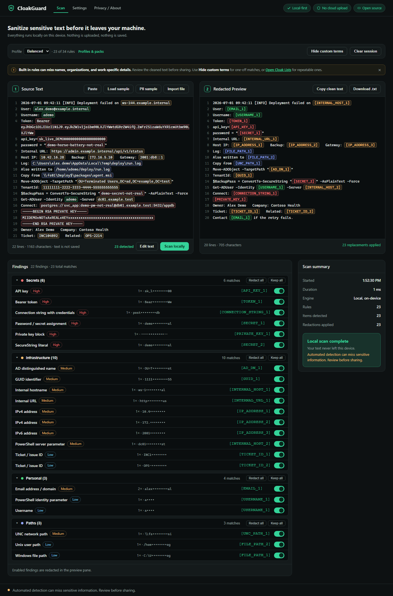

# CloakGuard

[](https://github.com/benthompsondev/cloakguard/actions/workflows/ci.yml)
[](https://github.com/benthompsondev/cloakguard/releases/latest)
[](LICENSE)

CloakGuard is a local-first Windows app for cleaning code, logs, prompts, support tickets, and draft posts before sharing them. Everything runs on your device. There is no account, backend, telemetry, or upload.

I built it because manually checking every script and log for hostnames, usernames, paths, tokens, and organization-specific details is slow and easy to get wrong. The workflow is deliberately simple: paste text, scan it locally, review every replacement, and copy the cleaned version.



## Download for Windows

Download the latest setup executable from [GitHub Releases](https://github.com/benthompsondev/cloakguard/releases/latest). The setup EXE is the only file most people need. It installs for the current Windows user and does not require Node, Rust, administrator rights, or an internet connection.

The installer is currently unsigned, so Windows SmartScreen may show a warning. Verify the SHA-256 value published with the release before running it.

## Run from source

**Windows** - from this folder in PowerShell:

```powershell
.\Start-CloakGuard.ps1
```

**macOS / Linux** - from this folder in a terminal:

```bash
./start-cloakguard.sh
```

Both scripts check that a supported Node.js is installed: **Node 20.19+ or 22.12+**. They never install Node for you or need admin/root. They run `npm ci` only when dependencies are missing or out of sync with `package-lock.json`, then build the production app with its strict Content Security Policy and serve it on `127.0.0.1`.

**To stop the app:** press `Ctrl+C` in the terminal window where it is running.

Developers can build the Windows desktop installer with `npm run desktop:build`; details are in [docs/desktop.md](docs/desktop.md).

**Developer setup** (`npm run dev` is the development path, with hot reload and no CSP):

```powershell
npm ci            # install dependencies
npm run dev       # dev server (development only)
npm run check     # lint + unit tests + typecheck + build
npm run test:e2e  # Playwright desktop tests (first: npx playwright install chromium)
npm run verify    # audit + lint + unit tests + build + e2e, all in one
```

## What it does

1. Paste text, import a text/log/code/config file (read in memory, max 2 MB; UTF-8 and UTF-16 PowerShell files both decode correctly), or load a built-in synthetic sample: **Load sample** for an IT/admin log or **PII sample** for personal data.
2. Click **Scan locally**. CloakGuard has 34 focused detectors covering common secrets, credentials, network details, file paths, cloud identifiers, personal data, and regional formats. Balanced handles the common cases. Strict adds labeled personal information. Country packs add validated Canadian, US, and EU formats. See [Detector behavior and safety](docs/detectors.md) for the full list and known limits.
3. Use **Hide custom terms** for exact names, domains, hostnames, project names, or other values the built-in rules cannot know. These terms last for the current session only. For reusable terms, create a **Cloak List** under Settings > Profiles & Packs.
4. Review the findings. Each one shows its category, severity, a masked preview, and the replacement placeholder. Toggle off anything you want to keep.
5. Copy the cleaned output or download it as a `.txt` file. Formatting is preserved, and repeated values reuse the same placeholder.

## Settings

The **Settings** view (in-app navigation, no page reloads) controls detection without touching any code:

- **General** - Choose Balanced or Strict detection and control the opt-in preference storage.
- **Profiles & Packs** - Build reusable profiles from country packs, Cloak Lists, custom rules, and a redaction format. The Profile Editor keeps changes in a draft until you save. You can also create a new Cloak List or Custom Pack without leaving that draft.
- **Detection Rules** - Search the detector registry, review false-positive guidance, and enable or disable individual rules.
- **Redaction Formats** - Use indexed labels (`[EMAIL_1]`), unnumbered labels (`[EMAIL]`), a uniform `[REDACTED]` value, or a safe template using `{TYPE}` and `{INDEX}`.
- **Privacy** - Review storage status and clear saved preferences.

**Preference storage is opt-in and narrow.** By default, named profiles, custom packs, Cloak Lists, custom rules, and terms vanish on reload. If you enable "Remember preferences", one allowlisted localStorage key stores the configuration, never source text, filenames, findings, matched values, output, or clipboard data. Cloak List terms need a second per-list opt-in before they are saved. Those saved values are plain, unencrypted local data. Terms entered through **Hide custom terms** never persist.

**Why no scan history:** sanitized output can still contain a value the detectors missed, so automatically saving results would weaken the privacy model. Scans are deliberately never persisted.

Detector findings are review leads, not verdicts. CloakGuard protects common PowerShell regex pattern strings, leaves generated password expressions untouched, and avoids guessing that arbitrary AD arguments are usernames. See [Detector behavior and safety](docs/detectors.md) for the exact replacement rules and remaining boundaries.

## Verify it works

Run `npm run check`. Lint, unit tests, typecheck, and build should all pass. `npm run test:e2e` runs Playwright against the production build, including a check that the app contacts no non-local origin.

## Privacy model

- All scanning happens locally. CloakGuard makes no remote application requests, telemetry, or analytics calls. The production launcher binds to `127.0.0.1`.
- Content is never persisted. Refresh or **Clear session** wipes source text, findings, output, and session-only custom terms. The only optional storage is the narrow preference configuration described above.
- Imported files are read with the browser File API and never uploaded. Downloads are generated in memory.
- Detected values are masked in the UI and never logged. The production build also has a strict Content Security Policy that blocks outbound browser connection APIs.
- **Automated detection can miss sensitive information. Review before sharing.** This is a helper, not a guarantee. See [SECURITY.md](SECURITY.md).

## Project status

Current release: **v0.7.3**

- The Scan screen now gives a visible reminder that built-in rules can miss context-specific details and links directly to Cloak Lists.
- The Profile Editor can create a Cloak List or Custom Pack without throwing away the profile draft.
- Name and organization detection covers structured fields, CSV columns, headers, signatures, common prose cues, copyright lines, and strong organization suffixes.
- Name and organization findings stay low-confidence by design. A universal name dictionary would still miss people while falsely matching ordinary words, so Cloak Lists handle exact names and company terms that matter to the user.
- Command syntax, JSON structure, CSV formatting, and common PowerShell regex patterns have regression coverage so broader detection does not casually break code.

CloakGuard is still a detection helper, not a guarantee or compliance product. Always review the cleaned text before sharing it.

## Contributing

Issues and pull requests are welcome. Use synthetic examples only and read [CONTRIBUTING.md](CONTRIBUTING.md) before sharing a detector sample.

Five synthetic files under [examples/stress-tests](examples/stress-tests) are available for longer manual checks covering PowerShell, support logs, mixed configuration, custom organization terms, and name/organization detection.

## License

MIT. See [LICENSE](LICENSE).
