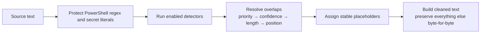

# How CloakScan works

CloakScan is intentionally small. Text goes in, enabled rules inspect it in memory, and cleaned text comes out for review. There is no server in the middle.

## Scan pipeline

The scanner first protects PowerShell regex and code-shaped secret expressions that should stay as code. It then runs only the detectors enabled by the active configuration. When findings overlap, the winner is chosen by priority, confidence, match length, and source position, in that order.

Repeated values receive stable placeholders, so the same email becomes `[EMAIL_1]` everywhere it appears. The final pass copies the original text byte-for-byte between replacements. That keeps indentation, line endings, CSV columns, and surrounding code intact.

## Configuration order

Settings are applied in a predictable order:

1. Built-in profile: Balanced, Strict, Maximum, or Code & secrets
2. Country packs
3. Custom packs
4. Per-rule overrides
5. Custom labeled-field rules
6. Cloak Lists and session-only terms from **Hide custom terms**, including their optional term-only format

Later layers add or override the earlier configuration. They do not replace the scan engine.

## Privacy model

Source text, filenames, findings, cleaned output, and session-only terms stay in memory. Closing or refreshing the app clears them, and **Clear session** does the same on demand — including suggestions, dismissals, the pending Cloak List seed, and the comparison and export panels.

The output-mode comparison (`src/lib/comparison.ts`) and the Portfolio Export Kit (`src/lib/portfolioExport.ts`) follow the same rule. The comparison splices both sanitized versions from findings the scan already produced — no rescan, no original values in any field. The export summary builder receives an aggregates object (counts and mode/version strings), never findings, so exported metadata cannot contain a matched value, term, configuration name, or source excerpt. Export files are generated at click time and handed straight to the download path, never held in state.

Preference storage is off by default. If the user enables it, CloakScan writes one narrow `localStorage` key containing allowlisted configuration. It never stores scan content, findings, or output. There is no scan history by design because cleaned text can still contain something a rule missed.

The production build has a strict Content Security Policy. Outbound browser connection APIs are blocked, and the app has no analytics, telemetry, or backend. The browser demo never exposes the desktop updater.

## Desktop boundary

The desktop app uses a Tauri 2 shell around the same client-side interface, on Windows (WebView2) and Linux x86_64 (WebKitGTK). Its only app-specific Rust commands export cleaned text to a user-approved path and report whether the current package can update itself. The export command accepts a suggested filename, but only from an exact allowlist (`cloakscan-clean.txt` and the three Portfolio Export Kit names) — anything else, including path separators, traversal, or other extensions, is rejected before the dialog opens, and the user still picks the real destination. Scanning and redaction still happen in the React app.

Project links use Tauri's opener plugin because ordinary external anchors do not reliably leave an embedded webview. The capability permits only CloakScan's GitHub repository and GitHub Pages demo. It cannot open arbitrary sites or local files.

The Tauri configuration is split into a shared platform-neutral file (`tauri.conf.json`) plus per-platform overlays (`tauri.windows.conf.json`, `tauri.linux.conf.json`) that hold only packaging and webview details. Security, capabilities, the updater key, and the endpoint live in the shared file, and a unit test fails if an overlay tries to change them.

## Updates

The desktop app can check GitHub for a newer release, but only after the user clicks **Check for updates**. There is no launch check, timer, background polling, or telemetry.

The updater runs through Tauri's Rust plugin. The webview asks the plugin to check, download, and install a signed package; it does not make the network request itself. The production CSP stays unchanged at `connect-src 'none'`, and browser builds do not show update controls.

Each update artifact is signed with CloakScan's updater key. The public key ships with the app so Tauri can reject a package with the wrong signature. This verifies the update package, but it is separate from OS code signing: the Windows installer is still unsigned and may show a SmartScreen warning. On Linux, the AppImage is the auto-update artifact; the `.deb` package is updated by installing the newer package yourself (see [docs/linux.md](linux.md)).

## Why there is no universal name or company dictionary

Names and organizations are detected from context such as labeled fields, CSV headers, signatures, copyright lines, and common prose cues. A universal dictionary would still miss real names while falsely redacting ordinary words.

For known people, departments, domains, hostnames, or organization terms, use a **Cloak List**. Exact terms are more predictable when the user already knows what must be removed.
